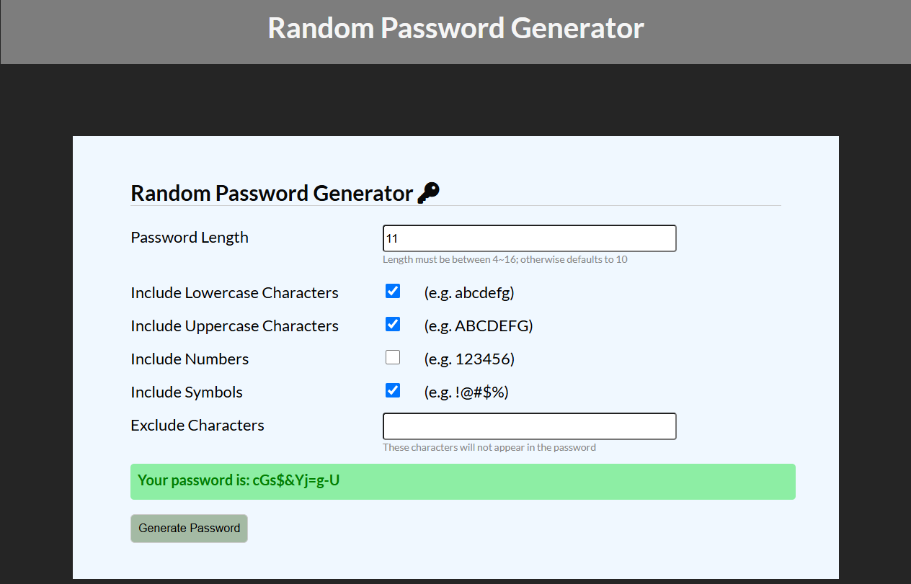

# Password Generate
---


## Introduction
Enter the desired password length (default is 10)
Select at least one requirement
Click the "Generate Password" button to generate a password based on the selected criteria

## Getting Started

> Ensure `Node.js` is installed on your machine

1. Clone the repo
```
$ git clone https://github.com/momochch/password-generator.git
```

2. Go to the project file
```
$ cd password-generator
```

3. Install npm
```
$ npm install
```

4. Start the web app
```
$ npm run start
```

5. Click the link to use it
```
http://localhost:3000
```

6. Close the link
```
Ctrl+c
```

## Development tools
- express.js
- express-handlebars
- Node.js
- CSS
- Javascript
